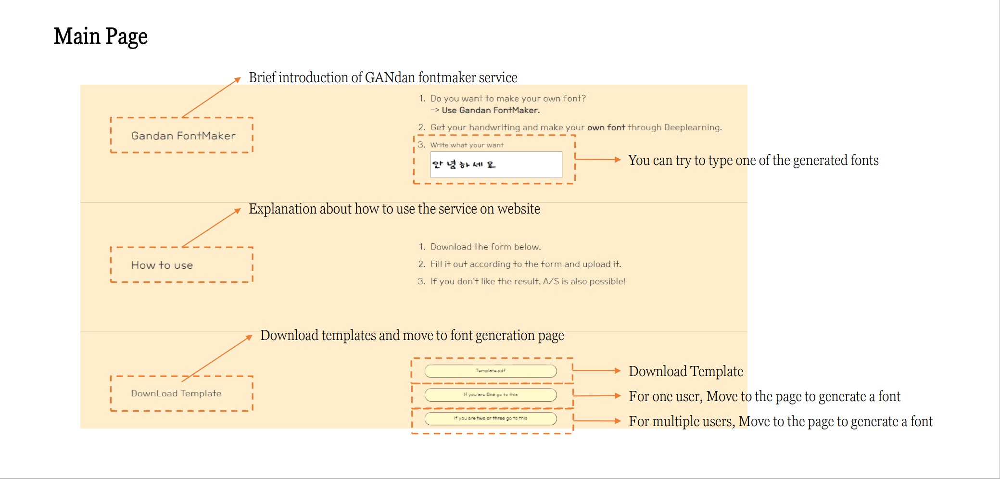
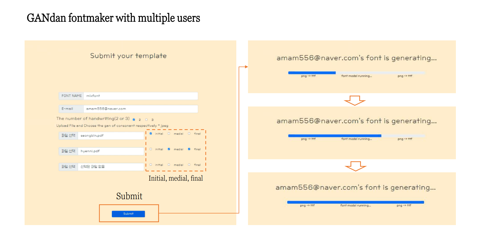
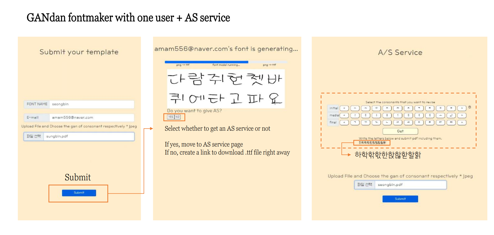

# 2021-2 Capstone project(SWE3028): TeamA - Jjangdol

## Fontmaking Webservice using AI model : DM-font 

### Brief Explanation


Hangul is a language that is composed of initial, medial, and final consonant. This leads to 11,172 combinations of characters in Hangul. For this reason, the current method of designing all the characters by hand is very expensive and time-consuming compared to English. We developed web-service(GANdan-fontmaker) based on Dual Memory-Augmented Font Generation Network(DM-font). Our service provides two distinctive functions; combining people’s font style and re-correcting font style for satisfying user needs.


## Environment

#### Install dependencies in Conda Env:

```commandline
conda install --name CONDA_ENV_NAME --file requirements.txt
```
Note that using different version of required packages can effects the results, especially PyTorch. The implementations are tested on Python 3.7+


#### Please pull out the dmfont, and ProgramFiles directories outside of Capstone-project directory
```
.
├── dmfont                 # From Capstone-project directory
├── Capstone-project       # At first, contains dmfont, and ProgramFiles directories
│   ├── FlaskProj          
│   ├── web1               
│   └── ...                
└── ProgramFiles           # From Capstone-project directory

```
#### Please check your local Path in FlaskProj directory
```
.
├── dmfont                 
├── Capstone-project      
│   ├── FlaskProj          
│   │   ├── HelloWorld.py  # modify the localPath                
│   │   ├── Png2Svg.py     # modify the localPath     
│   │   ├── Svg2Ttf.py     # modify the localPath
│   │   ├── Template.py    # modify the localPath, webPublicPath, popplerPath  
│   │   └── ...                
└── ProgramFiles           

```

## Installation

### OpenSources:


[FontForge](https://fontforge.org/en-US/) : Fully formatted font editor that can support all plain font formats, To Convert SVG to TTF <br />
-> Download FontForge for Windows : "FontForge-2020-11-07-Windows.exe", and install.

[ImageMagick](https://imagemagick.org/script/download.php#windows) : Opensource used to create or fix graphic images, To Convert PNG to PNM <br />
-> Download Latest Version: "ImageMagick-7.1.0-17-Q16-HDRI-x64-dll.exe" and install it, and add the path to your SYSTEM PATH

[Poppler](https://blog.alivate.com.au/poppler-windows/) : Library that performs PDF document rendering <br />
-> Download Latest binary : "poppler-0.68.0_x86" from this website, unzip it in **ProgramFiles directory**

[potrace](http://potrace.sourceforge.net/) : Cross-platform that converts bitmap images into vector graphics,To Convert PNM to SVG <br />
-> Already installed and uploaded to Github, so no need to re-download.
### Pretrained model
Data sources for Korean-handwriting datasets were built from [UhBee fonts](http://uhbeefont.com/). For running the DM-font, pretrained model below.

● [Checkpoint trained on the Korean-handwriting dataset](https://drive.google.com/file/d/1y_8XDNtawtA2P7-pHbCQ3yGEcFX-9H1R/view?usp=sharing)
```
.       
├── dmfont       
│   ├── checkpoints                 # Make directory named "checkpoints"
│   │   ├── korean-handwriting.pth  # Download Pretrained model
│   └── ...                
└── ...

```

## How To Run

```
.
├── dmfont                
├── Capstone-project       # set the terminal(1) on this directory
│   ├── web1               # set the terminal(2) on this directory
│   ├── FlaskProj          # set the terminal(3) on this directory
│   └── ...                
└── ProgramFiles           

```
In terminal(1) Server using node.js will run. <br />
In terminal(2) Frontend using React will run. <br />
In terminal(3) Flask server will run.
<br />
#### terminal command:
```
terminal(1)> node server
terminal(2)> npm start
terminal(3)> python HelloWorld.py
```
You can test on localhost:3000/
## How To Use & Demo

You can get the project information and Demo [HERE](https://youtu.be/8tiPPnAHw38)





